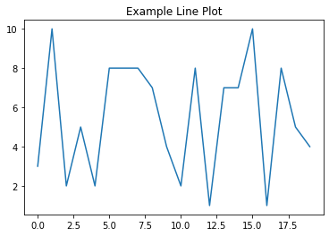

# DS Curriculum Tooling

On the DS curriculum team, we write most of the curriculum in Jupyter Notebook files (files ending in `.ipynb` extensions).

Jupyter Notebook files are composed of Markdown as well as Python code.

## Markdown Examples

Here are some Markdown examples:

## Markdown H2

### Markdown H3

Here is some inline code written in Markdown: `x = 2 + 3`

and block code that is in a Markdown cell, so it isn't actually executable:

```sql
SELECT * FROM employees;
```

There is also **bold** and *italics* and ***both bold and italics***

## Python Examples

Here are some Python examples:

You can run one line at a time:


```python
y = 3 + 4
```

If you only type an expression without assigning to anything, you see the result of the expression echoed, just like in a REPL:


```python
y
```


    7


You can also see print output. In the context of a notebook or HTML, there is no "Out" line for print statements like there is with the result of an expression being echoed. In Markdown there is no difference.


```python
print("Hello, world!")
```

    Hello, world!


Or you can have multiple lines in the same Python cell:


```python
import random
random.seed(1)
numbers = [random.randrange(1, 11) for x in range(20)]
numbers
```


    [3, 10, 2, 5, 2, 8, 8, 8, 7, 4, 2, 8, 1, 7, 7, 10, 1, 8, 5, 4]


If the code produces an image output, it will appear inline in the notebook (`.ipynb`). In order for it to appear in the exported version, you need to make sure you have the relevant images exported also.


```python
import matplotlib.pyplot as plt

fig, ax = plt.subplots()

ax.plot(numbers)
ax.set_title("Example Line Plot");
```


    

    


## Tools Needed

The notebook (`.ipynb` file) is created and edited using Jupyter Notebook. You can play around with a browser-based notebook [here](https://jupyter.org/try). (We use Classic Notebook but you could also try Jupyter Lab.)

The easiest way to get a local Jupyter Notebook setup is using [Anaconda](https://docs.anaconda.com/anaconda/install/). There is also a graphical interface called [Anaconda Navigator](https://docs.anaconda.com/anaconda/navigator/getting-started/) that is easier to deal with than the pure CLI version (which can sometimes run into issues with `~/.bash_profile` settings, etc.)

DS students use Jupyter Notebook files directly, using a cloud platform called IllumiDesk or on their local machines (cloning content stored on GitHub). But you can also use various tools to export the notebook content for other formats.

The [`nbconvert` tool](https://nbconvert.readthedocs.io/en/latest/index.html) can convert a notebook to Markdown as well as HTML and PDF. (PDF requires additional dependencies.)

### Exporting Notebooks to Markdown

Markdown is a convenient export format because it's very clean and simple, but it loses some information. The file `index.md` was created from `index.ipynb` using this command in the terminal:

```bash
jupyter nbconvert --to markdown index.ipynb`
```

This also creates a directory called `index_files` containing any images generated in the notebook.

### Exporting Notebooks to HTML

HTML has a lot more style information that can be contained in it. The file `index.html` was created from `index.ipynb` using this command in the terminal:

```bash
jupyter nbconvert --to html --template basic index.ipynb
```

The default behavior is to create a giant file with a lot of CSS, so I think you probably want to use the `--template basic` option, but it's optional.
